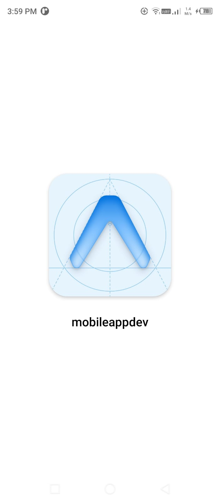
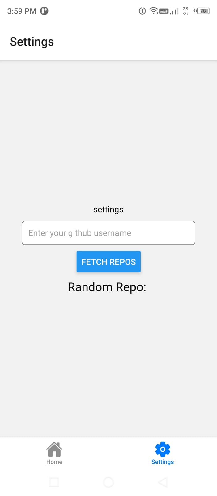

# Random-github-repo-search-mobile-app
- build with expo - a fullstack react native framework
## Testing
- `starting expo-page`

- `Home`

- `settings`

- `test 1`

- `test 2`

- `test 3`

## Thanks for visiting ⚡👍